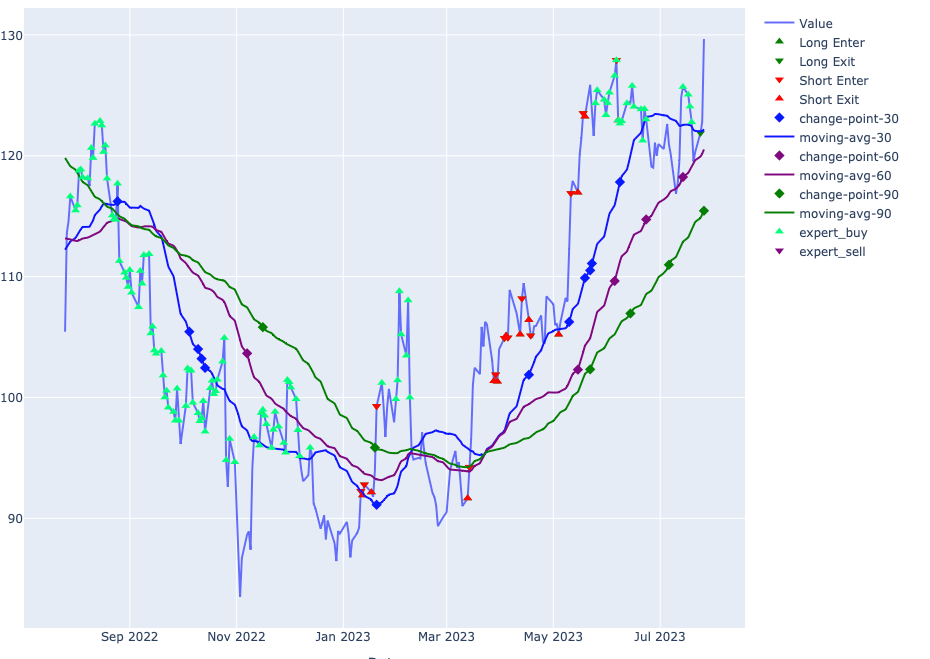
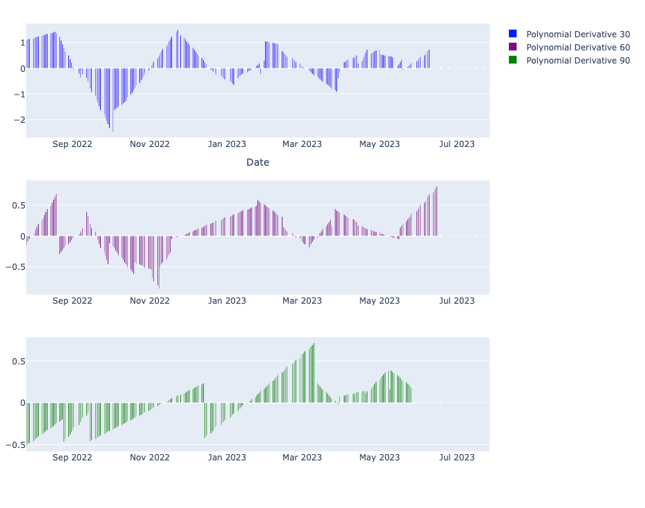

# Project Overview

This project is a collection of scripts, tools, and experiments that I've put together as I learn more about reinforcement learning and the [Stable-Baselines 3](https://stable-baselines3.readthedocs.io/en/master/) framework. The core focus is to train an AI system to identify the best entry and exit points for trades based on various indicators of price movement. It's still a work in progress, but the journey so far has been extremely informative and rewarding.

## Project Concept

The central idea driving this project is that with the right data and indicators, an AI agent can be trained to recognize market trends and outperform traditional buy-and-hold strategies. The goal is to create a system that can handle time series data from any market and make trades based on the trends it identifies. This system is built on the reinforcement learning framework provided by Stable-Baselines 3.

The methodology can be broken down into the following steps:

The AI system does not directly receive any price data. Instead, it works with a series of moving averages (30, 60, 90 days) that are processed using [Bayesian Online Changepoint Detection](https://github.com/y-bar/bocd). This method allows for the detection of changes in the moving averages without lookahead bias, a common issue in other change detection algorithms. Polynomial regressions are then calculated between different change points, and the derivatives of these polynomials are used as indicators of direction. 

To guide the AI's trading decisions, we also analyze the "best action" at each time slice in the time series. This is determined based on the maximum profit over 30, 60, and 90 day periods. While this method does incorporate lookahead bias, it is only used for establishing the AI's reward system.

The AI generates an action space consisting of 1s and 0s, with 0 indicating a bullish (buy) stance and 1 indicating a bearish (sell/short) stance. If the AI's action matches the optimal action, it receives a reward; if not, it incurs a penalty.

This project is a WIP and is actively being developed. You can follow the progress through live and past coding sessions on [YouTube](https://www.youtube.com/@cranialtrauma/) and [Twitch](https://www.twitch.tv/cranialtrauma).