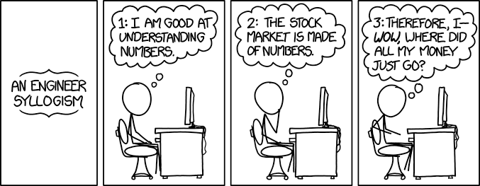

# Work in Progress 

Alfred is an experimental set of machine learning for markets and portfolio management. 

The plan for Alfred is to have 3 parts:

* A series of technical and fundamental analyst models that work on available data to try and project prices and future fundamentals
* One or maybe more language model analysts that will function as news and research digesters
* A reinforcement learning model portfolio manager that will ingest data from the ensemble of analysts and try to predict optimal portfolio makeup for some time period N. 

I'm currently in the stage of weighing effectiveness vs size for various technical analysts.  


# Experiment 1 - Projecting a quarterly velocity score

For a basic experiment we will examine whether a basic neural network without glancing back at detailed historical data can look at a roll up of quarterly features
and project an equity looks positive or negative for the following quarter. 

## Features

TODO - outline columns and the data that produces them

## Testing Data Approach

To get a solid experiment we want to:

1) Select a time range of reasonable length, since we'll be working across quarters. We'll only consider stocks exist and have existed since 2004
2) Select a handful of test stocks to train on that meet the time criteria and are relatively uncorrelated
3) Select another, again uncorrelated set of stocks and evaluate

### Candidates with enough history
To grab these stocks we'll use `scripts/scanner.py`. It will check out data directory output a list that enough history for the experiment


### Lack of Correlation

Next up we'll need to find some stocks that are uncorrelated. My approach here is to create a correlation matrix then pick a stock (AAPL for test), (F for eval) then select the stock least correlated to it.
Then pick a stock least correlated to the previous two so on and so forth. We'll do this for a test and eval set.

```
(venv) jmordetsky in ~/alfred (main) > python scripts/scanner.py --starting_ticker=AAPL
['AAPL', 'LNC', 'ATI', 'PRGO', 'JNPR', 'THC', 'MO', 'MAT', 'ALB', 'ROST', 'NEM']
(venv) jmordetsky in ~/alfred (main) > python scripts/scanner.py --starting_ticker=F
['F', 'AVB', 'MAC', 'ZION', 'FCX', 'ROST', 'SWK', 'PDCO', 'JNPR', 'T', 'HIG']
```

### The Label

We'll run `./scripts/create-basic-direction-data.py` against these tickers. Our label indicates "Is the future price higher than todays?"

As such we shift the future price to the past and check if it is > than the current price ala:

```
# our boolean checks to see if this ROW predicts a future price increase
comparison_result = quarterly_data["Close"].shift(-1) > quarterly_data["Close"]
```

### Correlations?

Next up we should probably take a look at which of our columns have naive correlation to our labels. We can do this with `scripts/feature-correlation.py`:

That generates an interested set of data, which is slightly depressing but not completely surprising (predicting the future is hard :) ). There are no really strong correlators
to quarterly price increase:

````text

PQ: 0.9999999999999999 - Very Strong
Close_diff_MA_90: 0.12892171826831145 - Very Weak
Margin_Gross: 0.1142569938393819 - Very Weak
Margin_Net_Profit: 0.10581040452589217 - Very Weak
Margin_Operating: 0.10279929789032917 - Very Weak
Close_diff_MA_180: 0.10091601601995985 - Very Weak
surprise: 0.08847178902031437 - Very Weak
^VIX: 0.0772748721272654 - Very Weak
surprisePercentage: 0.0746242823372321 - Very Weak
delta_surprisePercentage: 0.06686143047333952 - Very Weak
CL=F: 0.06139709088093088 - Very Weak
reportedEPS: 0.06131443260157919 - Very Weak
SPY: 0.060237998259389094 - Very Weak
estimatedEPS: 0.05514866597700653 - Very Weak
delta_^VIX: 0.05323173806282268 - Very Weak
insider_acquisition: 0.0398854615692598 - Very Weak
insider_disposal: 0.03408291420884296 - Very Weak
delta_insider_acquisition: 0.027500301568763978 - Very Weak
Close_diff_MA_30: 0.019272988736387695 - Very Weak
Close_diff_MA_7: 0.01756933471949962 - Very Weak
delta_insider_disposal: 0.014982149264578538 - Very Weak
delta_surprise: 0.010419266205410624 - Very Weak
Close: 0.010067864423516168 - Very Weak
Volume: 0.001043278963139337 - Very Weak
delta_SPY: -0.020424790826131415 - Very Weak
delta_CL=F: -0.03241308412432996 - Very Weak
delta_reportedEPS: -0.04088861812992127 - Very Weak
delta_estimatedEPS: -0.0466051589440676 - Very Weak
delta_mean_sentiment: -0.05141544424189076 - Very Weak
BTC=F: -0.05172377221830401 - Very Weak
delta_mean_outlook: -0.05399907814650073 - Very Weak
mean_sentiment: -0.06829949796739071 - Very Weak
mean_outlook: -0.0694016695074835 - Very Weak
delta_2year: -0.07574503914903966 - Very Weak
delta_Volume: -0.0775137319976775 - Very Weak
delta_Close: -0.08216866581240505 - Very Weak
delta_BZ=F: -0.08218229083223447 - Very Weak
delta_BTC=F: -0.08647960943079801 - Very Weak
2year: -0.08971257073156266 - Very Weak
10year: -0.09101558180056132 - Very Weak
3year: -0.09101558180056132 - Very Weak
5year: -0.0919723430909219 - Very Weak
delta_5year: -0.09339736617097226 - Very Weak
delta_10year: -0.09405986175375887 - Very Weak
delta_3year: -0.09405986175375887 - Very Weak
BZ=F: -0.13956943885419681 - Very Weak
delta_Margin_Gross: -0.1435668195894457 - Very Weak
Volume_diff_MA_90: -0.14944746202121892 - Very Weak
Volume_diff_MA_180: -0.15110832793311033 - Very Weak
Volume_diff_MA_30: -0.1574657530343537 - Very Weak
delta_Margin_Operating: -0.16011068939526674 - Very Weak
delta_Margin_Net_Profit: -0.17011037553899938 - Very Weak
Volume_diff_MA_7: -0.19504551648570898 - Weak
````
While all of our columns are weak our top performers were kinda surprising:

```
delta_5year: -0.09339736617097226 - Very Weak
delta_10year: -0.09405986175375887 - Very Weak
delta_3year: -0.09405986175375887 - Very Weak
BZ=F: -0.13956943885419681 - Very Weak
delta_Margin_Gross: -0.1435668195894457 - Very Weak
Volume_diff_MA_90: -0.14944746202121892 - Very Weak
Volume_diff_MA_180: -0.15110832793311033 - Very Weak
Volume_diff_MA_30: -0.1574657530343537 - Very Weak
delta_Margin_Operating: -0.16011068939526674 - Very Weak
delta_Margin_Net_Profit: -0.17011037553899938 - Very Weak
Volume_diff_MA_7: -0.19504551648570898 - Weak
```

These can be categorized as changes in interest rates, volume patterns and some fundemental data. 

### The model

So I guess the question is - are all of our weak or very weak correlations enough to allow for a well trained model to make a prediction?

To do so we need N features to go into a model that is of size Y to make a prediction from 0 (false) to 1 (true) and to clamp round
to the closest answer.

For my first crack at training I purposefully avoided LSTMs, GANs or Transformers that would be better at analyzing the historical aspects of 
the time series and used a plan old Neural Network which you can find [here](src/alfred/models/vanilla.py). Our first run
using 10 layers of size 256 didn't go so well. Trainer script is [here](scripts/experiments/easy_test.py) which leverages an "easy"
training wrapper I used for alfred to make this sort of thing faster, capped out with a pretty abysmal mse of 0.43 and ran out of 
patience cycling around numbers in this area. 

I decided to try a larger model, this time using 100 layers and 1024 params. All models served up via alfred can be easily
served up via `alfred.model_persistence.model_from_config` function. Using the framework models are stashed in and can be restored from 
mongodb. I don't really love mongo, but it was easy to use and I have a bunch of gpus floating around the network at my house and
this was a clever hack for being able to run multiple experiments at once on different computers.

Given `(size^2 * layers-1) + size * layers` we move from `(256**2 * 9) + 256 *10=592,384` to
`(1024**2 * 99) + (1024 * 100)=103,911,424`. A sizeable shift. These models can be found as `vanilla.small` and
`vanilla.large`.

However, even at this size the model plateaued at roughly at the same rate :(. 

I then also noticed, the `CustomScaler` I wrote had a major oversight in it. When I looked at the first level of activations
in our model, I noticed the values were exploding in one iteration. With some help from an AI, I spotted a massive value
in column 51 of my input data. Turns out, the scaler configuration supplied to the scaler was missing columns and there was
nothing in alfred's `CustomScaler` to catch it. I added that code, fixed the input and the subsequent values looked
much more reasonable.

> Hard lesson: LOOK CLOSELY AT YOUR INPUT before you look at other stuff in the case of exploding gradients! 

### Training and Performance

The very simple training script using `alfred's` `easy` wrapper is [here](scripts/experiments/easy_trainer.py)). This only trains against 
some subset of tickers. For now I used one, AAPL - the results of which are below. We'll expand on this, including other tickers for training and evaluating against
tickers we never trained on later.

I ran a quick test at 10 layers and size 256 I achieved decent performance on the training set (vanilla.small/256 is the default model):

> (venv) jmordetsky in ~/alfred (main) > python scripts/experiments/easy_trainer.py --tickers=metadata/basic-tickers.json

| Metric    | Value          |
|-----------|----------------|
| Best Loss | 7.9142e-07     |
| Accuracy  | 1.0000 (mps:0) |
| Precision | 1.0000 (mps:0) |
| Recall    | 1.0000 (mps:0) |
| F1 Score  | 1.0000 (mps:0) |


I then tried `vanilla.medium` which is 10 layers at 1024:

> (venv) jmordetsky in ~/alfred (main) > python scripts/experiments/easy_trainer.py --tickers=metadata/basic-tickers.json --model vanilla.medium --size 1024

| Metric    | Value          |
|-----------|----------------|
| Best Loss | 5.7641e-08     |
| Accuracy  | 1.0000 (mps:0) |
| Precision | 1.0000 (mps:0) |
| Recall    | 1.0000 (mps:0) |
| F1 Score  | 1.0000 (mps:0) |

First I should while I was happy with this outcome, the real test is on data the model hasn't seen so there is no real reason to get excited here. But after a day of abysmal scoring
due to scaling issues I'm happy to have landed here. Seeing 1's across the board for our metrics is nice, but also worrying about the possibily
of over fitting against our training stocks.

Because we're trying to predict if next quarter will be a good trade, we need to think a bit about the game theory of outcomes. While 
we likely cannot trade off binary classes, the thought exercise about which of these metrics is most valuable to trading environment is a useful one. For simplicty, 
I'll assume we will only issue buy orders or hold on True. On False we will either avoid buying or sell our position.

To get a sense on how we perform against data we've never seen, we'll use alfred's `easy_evaler` against our evaluation stocks. We'll test
`vanilla.small` and `vanilla.medium`

Medium: 

| Metric    | Value              |
|-----------|--------------------|
| Loss      | 6.602123483308945  |
| Accuracy  | 0.6287878751754761 |
| Precision | 0.6306695342063904 |
| Recall    | 0.6293103694915771 |
| F1        | 0.6299892067909241 |

Small:

| Metric    | Value          |
|-----------|----------------|
| Loss      | 13.9524        |
| Accuracy  | 0.5357 (mps:0) |
| Precision | 0.5313 (mps:0) |
| Recall    | 0.6401 (mps:0) |
| F1 Score  | 0.5806 (mps:0) |


*Accuracy* - gives us our overall performance at 95.8%. This is our total number of correct predictions. Ie, we want to be mostly correct in either direction
with our positions so we make and don't lose money. 

*Precision* - This is a measure of our true positives. Ie, if we make a trade thinking the market will go up how often are we right? Ie, we would be wrong around 5.5% of the time. 
That may not seem like a lot but depending on how wrong we are that could hurt.

*Recall* - Recall lets us know, of the universe of good trades, how many are we catching? So this being almost 100% (99.87) mixed with our precision score indicates that maybe we lean
toward predicting positive trades more often than not. Ie, we're getting all the good trades, but 5% of the time we're off.

*F1* - Gives us the balance of precision and recall. 

From a purely theoretical point of view, an F1 score of >  50 should allow us to make money at least on the
basket of evaluation stocks in question. However, there is that age old xkcd commic we should keep in mind:



There is more to a profitable trading strategy to be considered :).


## Back Testing Directional Signals

There are a few options available to us here moving forward, we could potentially play around with different model architectures and types and we can potentially increase the number of 
equities we're training against. Given the blessing that we're working with quarterly data, we can likely load up entire universes of equities for training and not hit any physical limits
on modern hardware. That said, I've mentioned before the directional indicator is a bit ham-fisted. If we're going to spend an enormous amount of time or hardware training on more data,
we should migrate the current network to predict something like the velocity or magnitude of the move.  

That said before we do that, given our results, what we can do is get an understanding of how impactful a 66% projection is from a profitability perspective against single equities vs buy and hold of a benchmark.

To do that we can run a basic experiment. We can choose take the uncorrelated equities from our evaluation set and for given period of time trade them long/short quarter over quarter in a back
test and compare the result to holding an index over the same time period. This won't be a sophisticated backtest, but it will let us know in theory what our model might perform like as
directional analyst. 

To do this I introduced `alfred.model_backtesting`. There were a few backtesters out in the world already, for example `backtesting.py` and `backtrader` but for various reasons I was jumping 
through hoops implementing what I wanted here, which was not a fully featured backtesting solution, but a smoke test of sorts. For example backtrader demands trades be executed on the next bar open
which is probably realistic, but not what needed for my quarter over quarter testing. When I did finally get it to work, something was going wrong with the broker execution framework and 
my buy orders were never executing. I opted for two of my own models. `SimpleBackTester` and `NuancedBackTester` which can see in [scripts/backtesting/vanilla-backtest.py](scripts/backtesting/vanilla-backtest.py).

The former simply checks if the prediction > 0.5. If so it takes a long posisiton, otherwise it takes a short position. Opposite signals are exits. The latter introduces a confidence level to the score. If the signal is > 0.7 or < 0.3 it will consider that a strong indicator to go long or short. A lesser score of >= 0.5 or < 0.5 is a signal to get out of a trade if we're in one. 

Seasoned traders will probably giggle at my lack of sophistication here, but again, I just wanted to get a sense of how our prediction scores would play out.

I ran two tests, both using `vanilla.medium`:

```shell
python scripts/backtesting/vanilla-backtest.py --test_ticker=F &&
python scripts/backtesting/vanilla-backtest.py --test_ticker=AVB &&
python scripts/backtesting/vanilla-backtest.py --test_ticker=MAC &&
python scripts/backtesting/vanilla-backtest.py --test_ticker=ZION &&
python scripts/backtesting/vanilla-backtest.py --test_ticker=FCX &&
python scripts/backtesting/vanilla-backtest.py --test_ticker=ROST &&
python scripts/backtesting/vanilla-backtest.py --test_ticker=SWK &&
python scripts/backtesting/vanilla-backtest.py --test_ticker=PDCO &&
python scripts/backtesting/vanilla-backtest.py --test_ticker=JNPR &&
python scripts/backtesting/vanilla-backtest.py --test_ticker=T &&
python scripts/backtesting/vanilla-backtest.py --test_ticker=HIG &&
echo "done"
```

Results were mixed for the simple back tests with roughly equal winners and losers and a mixed bag from a win rate perspective.

TODO: build a summary 


## Re-Examining Feature Importance

### Poor Man's Ablation
Earlier we looked at correlation of various features to our class of buy or sell. Now that we have a trained model I'd like to revisit that idea by doing a sort of rough sketch
sensitivity analysis or feature ablation and then looking at SHAP to see if it gives us different outcome. The idea here being if there are features we can fully eliminate when we 
try to train on more data or do a more complex prediction set we can perhaps be more efficient. [scripts/experiments/poor-mans-feature-ablation.py](scripts/experiments/poor-mans-feature-ablation.py)
implement a loop where we ablate each feature column and re-evaluate the model. 

The idea here is that if the model gets worse when the feature is ablated, then the feature is needed. If the model gets better when the feature is ablated, then the feature is perhaps noise. 
We also calculate differences for our other BCELoss stats. 

My theory is that we could drop anything that has both a positive impact on loss and negative impact on F1 (Ie, loss goes up, f1 goes down). But there wasn't much that fit this criteria:

````text
Ablation Study Results:
           Feature  Loss Change  f1 Change
0  Close_diff_MA_7     0.697478  -0.003172
````

Only `Close_diff_MA_7` ended up on the chopping block.

### SHAP

TODO: Revisit shap, I kept getting an error with the vanilla model: 

```
AssertionError: The SHAP explanations do not sum up to the model's output! This is either because of a rounding error or because an operator in 
your computation graph was not fully supported. If the sum difference of %f is significant compared to the scale of your model outputs, 
please post as a github issue, with a reproducible example so we can debug it. Used framework: pytorch - Max. diff: [some value] - Tolerance: 0.01
```

## Predicting Magnitudes

Now that we have a decent signal, prior to spending more money on training I wanted to mature our model. In this manner I want to try a few things:

1) Have the model predict a score representing the percent increase of the stock and perhaps some confidence measure
2) Have the model operate on a universe of evaluation tickers in its backtest. Ie, rather than trading against one ticker, look at all tickers and chose the one with the best score
3) Consider reinforcement learning for the above process

To do this, we'll need to recreate our training data. We'll add an `--operation` parameter to `scripts/create-basic-direction-data.py` to either be `direction` (bool) or `magnitude` 
(+/- percent change).

Changing the model slightly to not use sigmoid as its final activation, I retrained the model to look at its overall mse on the eval set. 

From here, we'll try something different. Rather than taking a position in the same stock based on teh signal, we'll run each of our evaluation stocks
through the backtester, but we'll only take a position in the stock with the highest predicted magnitude. 

From there based on the results we'll make a  call to train the model on a massive set of data (all stocks).

#### Try 1 - Same model, nn.Identity and MSE

I tweaked the model just slightly before running this test. I replaced the `nn.Sigmoid` activation with `nn.Identity` as the final
activation to `vanilla.medium` and gave it `nn.MSE` as our loss function. I also rolled a new accumulator `RegressionAccumulator` which
track some metrics in the way our `BCEAccumulator` did, the most important of which was `sign accuracy`. However, when running this test
I could not really get a decent level of loss and sign accuracy was never much higher than 50%. I'll explain why this was important to me below.

#### Try 2 - Same model, nn.Identity and custom Loss

After doing some thinking and some research I decided to try crafting my own loss function. The idea being I wanted to punish the model 
harder for missing sign. MSE measure a broad error in either direction. But in our case, it is actually much worse to get the direction wrong than it is for the magnitude to be off. We also know with our classifier runs that we should realy be able to do a good job on direction. Magnitude is essentially the ability for use to decide which of things headed in a direction is going there the fastest so we can certainly tolerate more error there than we can on direction. Ie, prediction that a stock will be +3% and it actually ends up going +1% is must better than prediction a stock will go up +1% and it really goes up -1%. Both are off by 2% but one lead us to a loss.

Initially I constructed `MSEWithSignPenalty` which you can see in `src/alfred/model_metrics/loss.py`. The idea here is based on some weight, we can apply the sign error to the mse and use that as the loss. I also rolled a version of this that uses Huber `HuberWithSignPenalty` and `SignErrorRatioLoss` which uses a score to either amplify or reduce mse and the sign error at some ratio. For example the default params for the ration are 0.5 to 2. This in theory dampens the value error and amplifies the sign error.

I also changed the final activation to Tanh. I broke the rule of tweaking too many thing here, but decided to take a shotgun approach because my first try was so lack luster in its ability to memorize the training data.

Huberloss and an increased model size (2024) gave us during training:

```text
Out of patience at epoch 1837. Patience count: 500/501. Limit: 500
Best loss: 0.1627537259613244, Best Stats: {'mae': 0.05751076340675354, 'r2': 0.07053571939468384, 'pearson_corr': 0.3521348536014557, 'sign_accuracy': 0.9211391018619934}
```

And for eval:
```text
Evaluation: Loss: 0.9553842600552626 stats: {'mae': 0.10528900474309921, 'r2': 0.05812478065490723, 'pearson_corr': 0.40794986486434937, 'sign_accuracy': 0.6911281489594743}
```

I decided to try that again with `SignErrorRatioLoss`. 

Evaluating with no training:

```text
(venv) jmordetsky in ~/alfred (main) > python scripts/experiments/easy_evaler.py --tickers ./metadata/basic-tickers.json --model vanilla.small.tanh --size 2048 --loss sign-ratio --file-post-fix=_quarterly_magnitude --label PM

WARNING: You are evaluating an empty model. This model was unknown to the system.

Evaluation: Loss: 1.4829210649276603 stats: {'mae': 0.36226388812065125, 'r2': -0.1713106632232666, 'pearson_corr': -0.021615857258439064, 'sign_accuracy': 0.547645125958379}
```

Best loss on the training data:
```text
(venv) jmordetsky in ~/alfred (main) > python scripts/experiments/easy_trainer.py --tickers ./metadata/basic-tickers.json --model vanilla.small.tanh --size 2048 --loss sign-ratio --file-post-fix=_quarterly_magnitude --label PM

Best loss: 0.6709100175367925, Best Stats: {'mae': 0.06811121851205826, 'r2': 0.07829374074935913, 'pearson_corr': 0.3725942075252533, 'sign_accuracy': 0.864184008762322}

```
Which did slightly worse against from a loss and sign accuracy perspective, which I found suprising.

Eval post training did worse on loss, but slightly better on sign accuracy.
```text
Evaluation: Loss: 1.0630815586506475 stats: {'mae': 0.10861995071172714, 'r2': 0.06449377536773682, 'pearson_corr': 0.40425240993499756, 'sign_accuracy': 0.7020810514786419}
```

I also wrote a script that looks at our label data and given a target accuracy tries to tell us what our mse should be `scripts/analyze-loss.py`. I was having a hard time knowing based on the range of my data if a "loss" was good or bad (though arguably most of our results are bad lol). This script will take a target r2 calculate mean, variance and std and based on that estimate an mse.
If we want our model to explain 80% of the data’s variance it aims for an MSE that’s 20% of the variance (0.2 × variance) and we would supply 0.8 (the default) to the script. 

```text
TRAINING

Analysis for 'PM' (Desired R² = 0.8):
  Variance (Baseline MSE): 1.4121
  Range: 49.4893
  Mean: 0.0630, Std: 1.1883
  Target MSE (R² = 0.8): 0.2824
  Target MSE (10% Range): 24.4919
  Suggested Target MSE: 24.4919
  Suggested Target RMSE: 4.9489 (avg error)
  Target RMSE as % of range: 10.0%
EVAL

Analysis for 'PM' (Desired R² = 0.8):
  Variance (Baseline MSE): 1.5578
  Range: 49.4874
  Mean: 0.0593, Std: 1.2481
  Target MSE (R² = 0.8): 0.3116
  Target MSE (10% Range): 24.4900
  Suggested Target MSE: 24.4900
  Suggested Target RMSE: 4.9487 (avg error)
  Target RMSE as % of range: 10.0%

```
Looking at our target MSE of roughly `.3` makes me feel okay about the Huber loss result on training but not great about any of our other
results.

### Trying out another network architecture

I wired up a new model called `vanilla.compression.tahn`. This is basically the same setup but rather than N layers of a fixed size,
the model uses 3 layers each decreasing the initial network size by 50%. I tested this at 2048 and landed with a post training loss of:

```text
Best loss: 0.6880370694501646, Best Stats: {'mae': 0.07100587338209152, 'r2': 0.0779222846031189, 'pearson_corr': 0.37335172295570374, 'sign_accuracy': 0.8521358159912377}
```

The eval loss was not a ton better than its previous version:
```text
Evaluation: Loss: 1.0694481803534943 stats: {'mae': 0.10864986479282379, 'r2': 0.0647653341293335, 'pearson_corr': 0.4073215425014496, 'sign_accuracy': 0.6987951807228916}
```

As a last check before looking at a back test and studying our outcomes more closely I trained another model of this kind at twice the size as well as our original model at twice the size 4096.

`vanilla.compress.tahn.4096 huber-sign` training/eval: 
```text
Pre train eval: 

Evaluation: Loss: 1.044123684537822 stats: {'mae': 0.2633186876773834, 'r2': -0.07346522808074951, 'pearson_corr': -0.00986915547400713, 'sign_accuracy': 0.5169769989047097}

Training:

Best loss: 0.1796942362862896, Best Stats: {'mae': 0.060097835958004, 'r2': 0.07199329137802124, 'pearson_corr': 0.3599674701690674, 'sign_accuracy': 0.9014238773274917}


Post train eval:
Evaluation: Loss: 0.6630501580473657 stats: {'mae': 0.11169926077127457, 'r2': 0.057153403759002686, 'pearson_corr': 0.35252252221107483, 'sign_accuracy': 0.6911281489594743}
```

Which, if I'm not mistaken is roughly our best result

`vanilla.small.tahn.4096 huber-sign` training/eval: 
```text
Pre train:
Evaluation: Loss: 1.1708936259664338 stats: {'mae': 0.3010151982307434, 'r2': -0.08084475994110107, 'pearson_corr': 0.02140171267092228, 'sign_accuracy': 0.45454545454545453}

Training:
Best loss: 0.18610617210325817, Best Stats: {'mae': 0.062222350388765335, 'r2': 0.07174217700958252, 'pearson_corr': 0.357318252325058, 'sign_accuracy': 0.8860898138006572}

Post train:
Evaluation: Loss: 0.7189666780402055 stats: {'mae': 0.11250916868448257, 'r2': 0.05626195669174194, 'pearson_corr': 0.36998236179351807, 'sign_accuracy': 0.6637458926615553}
```

The compressed architecture did slightly better, and our 4096 compressed did significantly better than our 2048. Given there was plenty of RAM available
on my M4 I decided to really go for it and train at max size but still against our small dataset. I used size 24000 this time:  

```text
Pre train:
Evaluation: Loss: 1.0985138457396935 stats: {'mae': 0.2700347304344177, 'r2': -0.09530162811279297, 'pearson_corr': -0.036143042147159576, 'sign_accuracy': 0.4939759036144578}


Training:
Out of patience at epoch 627. Patience count: 500/501. Limit: 500
Best loss: 1.3837785391971982, Best Stats: {'mae': 1.0133318901062012, 'r2': -0.900772213935852, 'pearson_corr': 0.04850158095359802, 'sign_accuracy': 0.5355969331872946}

Post train:
Evaluation: Loss: 1.5134698645821933 stats: {'mae': 1.027387261390686, 'r2': -0.9289259910583496, 'pearson_corr': 0.03586142882704735, 'sign_accuracy': 0.5060240963855421}

```
Which was interesting, because it just couldn't seem to learn at all. I couldn't help but wonder if that had something to do with our learning rate or optimizer setup.

Nonetheless, I went a little less aggressive afterward with 16384. It was equally unimpressive. I started to worry that the model was predicting
a range that always evaluated to 1 and -1. To deal with this, I removed the inner Tanh activation layer fearing it might be unnecessary with
the batch normalization right before it. I reran that with a 4096 model:

```text
Best loss: 0.18610617210325817, Best Stats: {'mae': 0.062222350388765335, 'r2': 0.07174217700958252, 'pearson_corr': 0.357318252325058, 'sign_accuracy': 0.8860898138006572}
```
But it had a harder time memorizing the training data than its predecessors. 

I then also modified easy to be more patient, but in the training loop and in LR reduction. I reran this with a 8192 sized model:

I then made some changes, I moved away from the compressed model and instead increased our number of layers AND added a normalization
layer to our model. This lead to the first ever result that didn't end in a patience loss, but rather ran out of epochs:

```
Best loss: 0.113925356641191, Best Stats: {'mae': 0.06269007176160812, 'r2': 0.04430222511291504, 'pearson_corr': 0.247194305062294, 'sign_accuracy': 0.8992332968236583}
```

The loss was our best yet, but our sign accuracy was lower. Emboldened, I doubled the size again and left it overnight but got
roughly the same result:

```text
Training:
Out of patience at epoch 3945. Patience count: 1500/1501. Limit: 1500
Best loss: 0.11361983619281091, Best Stats: {'mae': 0.05934416502714157, 'r2': 0.04976963996887207, 'pearson_corr': 0.26973167061805725, 'sign_accuracy': 0.9112814895947426}

Eval:
Evaluation: Loss: 0.5659032241256086 stats: {'mae': 0.10116428881883621, 'r2': 0.04964590072631836, 'pearson_corr': 0.41185587644577026, 'sign_accuracy': 0.7371303395399781}
```

Our MAE on the eval set means that we're going to roughly off by 10% when predicting magnitudes. Our pearson coeficient measures if the data 
moves linearly together which is weak, and our R^2 is quite low meaning there may be some additional variance we're missing. Our sign accuracy is high though,
higher than our previous accuracy on directionality. 


### Another small backtester

I wanted to see if given variability, we could still build a winning strategy out of evaluation set. This time I built a new backtester, `MagnitudeChoiceBacktester` into
`alfred.model_backtesting` which is designed to accept the magnitude predictions and decide on a best position per quarter from the entire 
basket of evaluation tickers. The results for the 8k vanilla model were pretty impressive: 


```text
--- Basket Hold Metrics ---

Equal-Weighted Buy and Hold Return (Entire Basket):
  Average Return: 513.42%

--- Trade Analysis ---
Total Completed Trades: 75
Profitable Trades: 47
Losing Trades: 24
Win Rate: 62.67%
Average Profit Percentage per Trade: 73.32%
Total Profit Percentage (sum of trade %): 5498.87%
```

I am however, too old and too jade to get overly excited about these values. Here is the entrie trade log for historical perspective:

```text
2004-03-31 00:00:00+00:00, SELL_SHORT CREATE, Price=57.10, Model Reading=-0.09931297600269318
Asset: ZION
2004-06-30 00:00:00+00:00, CLOSE_SHORT, Price=61.45, Profit=-4.35, Model Reading=-0.033495139330625534
Asset: ZION
2004-06-30 00:00:00+00:00, SELL_SHORT CREATE, Price=68.74, Model Reading=-0.11127478629350662
Asset: HIG
2004-09-30 00:00:00+00:00, CLOSE_SHORT, Price=61.93, Profit=6.81, Model Reading=-0.022320883348584175
Asset: HIG
2004-09-30 00:00:00+00:00, SELL_SHORT CREATE, Price=20.25, Model Reading=-0.07686863839626312
Asset: FCX
2004-12-31 00:00:00+00:00, CLOSE_SHORT, Price=19.11, Profit=1.14, Model Reading=-0.04416411742568016
Asset: FCX
2004-12-31 00:00:00+00:00, SELL_SHORT CREATE, Price=27.19, Model Reading=-0.16556617617607117
Asset: JNPR
2005-03-31 00:00:00+00:00, CLOSE_SHORT, Price=22.06, Profit=5.13, Model Reading=0.033106278628110886
Asset: JNPR
2005-03-31 00:00:00+00:00, SELL_SHORT CREATE, Price=66.47, Model Reading=-0.1052318811416626
Asset: AVB
2005-06-30 00:00:00+00:00, CLOSE_SHORT, Price=80.80, Profit=-14.33, Model Reading=-0.059867698699235916
Asset: AVB
2005-06-30 00:00:00+00:00, BUY CREATE, Price=10.24, Model Reading=0.08664829283952713
Asset: F
2005-09-30 00:00:00+00:00, CLOSE_LONG, Price=9.86, Profit=-0.38, Model Reading=0.04241602122783661
Asset: F
2005-09-30 00:00:00+00:00, SELL_SHORT CREATE, Price=60.13, Model Reading=-0.12666009366512299
Asset: MAC
2005-12-31 00:00:00+00:00, CLOSE_SHORT, Price=62.16, Profit=-2.04, Model Reading=-0.006175904534757137
Asset: MAC
2005-12-31 00:00:00+00:00, SELL_SHORT CREATE, Price=22.30, Model Reading=-0.13969644904136658
Asset: JNPR
2006-03-31 00:00:00+00:00, CLOSE_SHORT, Price=19.12, Profit=3.18, Model Reading=-0.1548193097114563
Asset: JNPR
2006-03-31 00:00:00+00:00, SELL_SHORT CREATE, Price=68.47, Model Reading=-0.16710475087165833
Asset: MAC
2006-06-30 00:00:00+00:00, CLOSE_SHORT, Price=65.00, Profit=3.47, Model Reading=-0.11985461413860321
Asset: MAC
2006-06-30 00:00:00+00:00, SELL_SHORT CREATE, Price=6.93, Model Reading=-0.16135258972644806
Asset: F
2006-09-30 00:00:00+00:00, CLOSE_SHORT, Price=8.09, Profit=-1.16, Model Reading=-0.07145638763904572
Asset: F
2006-09-30 00:00:00+00:00, BUY CREATE, Price=26.63, Model Reading=0.09868679195642471
Asset: FCX
2006-12-31 00:00:00+00:00, CLOSE_LONG, Price=27.86, Profit=1.24, Model Reading=-0.014727083034813404
Asset: FCX
2006-12-31 00:00:00+00:00, SELL_SHORT CREATE, Price=130.05, Model Reading=-0.1762787401676178
Asset: AVB
2007-03-31 00:00:00+00:00, CLOSE_SHORT, Price=130.00, Profit=0.05, Model Reading=-0.14913469552993774
Asset: AVB
2007-03-31 00:00:00+00:00, SELL_SHORT CREATE, Price=84.52, Model Reading=-0.15755490958690643
Asset: ZION
2007-06-30 00:00:00+00:00, CLOSE_SHORT, Price=76.91, Profit=7.61, Model Reading=-0.06819282472133636
Asset: ZION
2007-06-30 00:00:00+00:00, BUY CREATE, Price=25.17, Model Reading=0.2155776023864746
Asset: JNPR
2007-09-30 00:00:00+00:00, CLOSE_LONG, Price=36.61, Profit=11.44, Model Reading=-0.11008083075284958
Asset: JNPR
2007-09-30 00:00:00+00:00, SELL_SHORT CREATE, Price=92.55, Model Reading=-0.13044871389865875
Asset: HIG
2007-12-31 00:00:00+00:00, CLOSE_SHORT, Price=87.19, Profit=5.36, Model Reading=-0.08584856986999512
Asset: HIG
2007-12-31 00:00:00+00:00, SELL_SHORT CREATE, Price=51.22, Model Reading=-0.3495899736881256
Asset: FCX
2008-03-31 00:00:00+00:00, CLOSE_SHORT, Price=48.11, Profit=3.11, Model Reading=-0.10085910558700562
Asset: FCX
2008-03-31 00:00:00+00:00, SELL_SHORT CREATE, Price=28.93, Model Reading=-0.17689751088619232
Asset: T
2008-06-30 00:00:00+00:00, CLOSE_SHORT, Price=25.45, Profit=3.48, Model Reading=-0.056383002549409866
Asset: T
2008-06-30 00:00:00+00:00, SELL_SHORT CREATE, Price=58.60, Model Reading=-0.18507644534111023
Asset: FCX
2008-09-30 00:00:00+00:00, CLOSE_SHORT, Price=28.42, Profit=30.17, Model Reading=-0.11353877186775208
Asset: FCX
2008-09-30 00:00:00+00:00, SELL_SHORT CREATE, Price=41.74, Model Reading=-0.24553558230400085
Asset: SWK
2008-12-31 00:00:00+00:00, HOLD_SHORT SWK, Price=34.10, Model Reading=-0.1346954107284546
2009-03-31 00:00:00+00:00, CLOSE_SHORT, Price=29.12, Profit=12.62, Model Reading=0.0910080149769783
Asset: SWK
2009-03-31 00:00:00+00:00, BUY CREATE, Price=15.05, Model Reading=0.28524330258369446
Asset: JNPR
2009-06-30 00:00:00+00:00, CLOSE_LONG, Price=23.60, Profit=8.55, Model Reading=0.03374283015727997
Asset: JNPR
2009-06-30 00:00:00+00:00, BUY CREATE, Price=16.74, Model Reading=0.14598412811756134
Asset: MAC
2009-09-30 00:00:00+00:00, CLOSE_LONG, Price=29.39, Profit=12.64, Model Reading=-0.07634468376636505
Asset: MAC
2009-09-30 00:00:00+00:00, SELL_SHORT CREATE, Price=72.73, Model Reading=-0.0896165743470192
Asset: AVB
2009-12-31 00:00:00+00:00, CLOSE_SHORT, Price=82.11, Profit=-9.38, Model Reading=0.04101013392210007
Asset: AVB
2009-12-31 00:00:00+00:00, SELL_SHORT CREATE, Price=10.00, Model Reading=-0.13203945755958557
Asset: F
2010-03-31 00:00:00+00:00, CLOSE_SHORT, Price=12.57, Profit=-2.57, Model Reading=-0.05042007565498352
Asset: F
2010-03-31 00:00:00+00:00, SELL_SHORT CREATE, Price=30.68, Model Reading=-0.2040460705757141
Asset: JNPR
2010-06-30 00:00:00+00:00, CLOSE_SHORT, Price=22.82, Profit=7.86, Model Reading=0.1402224451303482
Asset: JNPR
2010-06-30 00:00:00+00:00, BUY CREATE, Price=22.82, Model Reading=0.1402224451303482
Asset: JNPR
2010-09-30 00:00:00+00:00, HOLD_LONG JNPR, Price=30.35, Model Reading=0.07684870809316635
2010-12-31 00:00:00+00:00, CLOSE_LONG, Price=36.92, Profit=14.10, Model Reading=0.03386886417865753
Asset: JNPR
2010-12-31 00:00:00+00:00, SELL_SHORT CREATE, Price=66.87, Model Reading=-0.10961189866065979
Asset: SWK
2011-03-31 00:00:00+00:00, CLOSE_SHORT, Price=76.60, Profit=-9.73, Model Reading=-0.06727119535207748
Asset: SWK
2011-03-31 00:00:00+00:00, SELL_SHORT CREATE, Price=42.08, Model Reading=-0.20099639892578125
Asset: JNPR
2011-06-30 00:00:00+00:00, HOLD_SHORT JNPR, Price=31.50, Model Reading=-0.3248614966869354
2011-09-30 00:00:00+00:00, CLOSE_SHORT, Price=17.26, Profit=24.82, Model Reading=0.05467883497476578
Asset: JNPR
2011-09-30 00:00:00+00:00, BUY CREATE, Price=30.45, Model Reading=0.10122602432966232
Asset: FCX
2011-12-31 00:00:00+00:00, CLOSE_LONG, Price=36.79, Profit=6.34, Model Reading=-0.014611315913498402
Asset: FCX
2011-12-31 00:00:00+00:00, SELL_SHORT CREATE, Price=2.95, Model Reading=-0.054805316030979156
Asset: ROST
2012-03-31 00:00:00+00:00, CLOSE_SHORT, Price=2.95, Profit=0.00, Model Reading=-0.05337779223918915
Asset: ROST
2012-03-31 00:00:00+00:00, SELL_SHORT CREATE, Price=22.88, Model Reading=-0.22423818707466125
Asset: JNPR
2012-06-30 00:00:00+00:00, CLOSE_SHORT, Price=16.31, Profit=6.57, Model Reading=-0.021914692595601082
Asset: JNPR
2012-06-30 00:00:00+00:00, SELL_SHORT CREATE, Price=64.36, Model Reading=-0.17098486423492432
Asset: SWK
2012-09-30 00:00:00+00:00, CLOSE_SHORT, Price=76.25, Profit=-11.89, Model Reading=-0.07574766874313354
Asset: SWK
2012-09-30 00:00:00+00:00, SELL_SHORT CREATE, Price=28.47, Model Reading=-0.0804804265499115
Asset: T
2012-12-31 00:00:00+00:00, CLOSE_SHORT, Price=25.46, Profit=3.01, Model Reading=0.020733371376991272
Asset: T
2012-12-31 00:00:00+00:00, SELL_SHORT CREATE, Price=73.97, Model Reading=-0.09544213116168976
Asset: SWK
2013-03-31 00:00:00+00:00, CLOSE_SHORT, Price=80.97, Profit=-7.00, Model Reading=-0.029635407030582428
Asset: SWK
2013-03-31 00:00:00+00:00, SELL_SHORT CREATE, Price=25.80, Model Reading=-0.15865740180015564
Asset: HIG
2013-06-30 00:00:00+00:00, CLOSE_SHORT, Price=30.92, Profit=-5.12, Model Reading=0.001529912231490016
Asset: HIG
2013-06-30 00:00:00+00:00, SELL_SHORT CREATE, Price=77.30, Model Reading=-0.18004591763019562
Asset: SWK
2013-09-30 00:00:00+00:00, CLOSE_SHORT, Price=90.57, Profit=-13.27, Model Reading=-0.009437216445803642
Asset: SWK
2013-09-30 00:00:00+00:00, SELL_SHORT CREATE, Price=56.44, Model Reading=-0.11736340820789337
Asset: MAC
2013-12-31 00:00:00+00:00, CLOSE_SHORT, Price=58.89, Profit=-2.45, Model Reading=-0.060255713760852814
Asset: MAC
2013-12-31 00:00:00+00:00, SELL_SHORT CREATE, Price=118.23, Model Reading=-0.10437775403261185
Asset: AVB
2014-03-31 00:00:00+00:00, CLOSE_SHORT, Price=131.32, Profit=-13.09, Model Reading=-0.014228396117687225
Asset: AVB
2014-03-31 00:00:00+00:00, SELL_SHORT CREATE, Price=25.76, Model Reading=-0.08073186129331589
Asset: JNPR
2014-06-30 00:00:00+00:00, CLOSE_SHORT, Price=24.54, Profit=1.22, Model Reading=-0.1091025248169899
Asset: JNPR
2014-06-30 00:00:00+00:00, SELL_SHORT CREATE, Price=66.75, Model Reading=-0.12227664887905121
Asset: MAC
2014-09-30 00:00:00+00:00, HOLD_SHORT MAC, Price=63.83, Model Reading=-0.13449303805828094
2014-12-31 00:00:00+00:00, HOLD_SHORT MAC, Price=83.41, Model Reading=-0.10275232791900635
2015-03-31 00:00:00+00:00, HOLD_SHORT MAC, Price=84.33, Model Reading=-0.09299005568027496
2015-06-30 00:00:00+00:00, CLOSE_SHORT, Price=74.60, Profit=-7.85, Model Reading=-0.08253045380115509
Asset: MAC
2015-06-30 00:00:00+00:00, SELL_SHORT CREATE, Price=31.74, Model Reading=-0.09895318746566772
Asset: ZION
2015-09-30 00:00:00+00:00, CLOSE_SHORT, Price=27.54, Profit=4.20, Model Reading=-0.0038751044776290655
Asset: ZION
2015-09-30 00:00:00+00:00, SELL_SHORT CREATE, Price=2.95, Model Reading=-0.05378125235438347
Asset: ROST
2015-12-31 00:00:00+00:00, CLOSE_SHORT, Price=2.95, Profit=0.00, Model Reading=-0.0541863776743412
Asset: ROST
2015-12-31 00:00:00+00:00, SELL_SHORT CREATE, Price=43.46, Model Reading=-0.13535945117473602
Asset: HIG
2016-03-31 00:00:00+00:00, CLOSE_SHORT, Price=46.08, Profit=-2.62, Model Reading=-0.05176980048418045
Asset: HIG
2016-03-31 00:00:00+00:00, SELL_SHORT CREATE, Price=25.51, Model Reading=-0.12507116794586182
Asset: JNPR
2016-06-30 00:00:00+00:00, CLOSE_SHORT, Price=22.49, Profit=3.02, Model Reading=-0.00975207332521677
Asset: JNPR
2016-06-30 00:00:00+00:00, SELL_SHORT CREATE, Price=47.89, Model Reading=-0.08214706927537918
Asset: PDCO
2016-09-30 00:00:00+00:00, HOLD_SHORT PDCO, Price=45.94, Model Reading=-0.09513300657272339
2016-12-31 00:00:00+00:00, CLOSE_SHORT, Price=41.03, Profit=6.86, Model Reading=-0.0031043700873851776
Asset: PDCO
2016-12-31 00:00:00+00:00, SELL_SHORT CREATE, Price=43.04, Model Reading=-0.08669315278530121
Asset: ZION
2017-03-31 00:00:00+00:00, CLOSE_SHORT, Price=42.00, Profit=1.04, Model Reading=-0.025670157745480537
Asset: ZION
2017-03-31 00:00:00+00:00, SELL_SHORT CREATE, Price=64.40, Model Reading=-0.07663340866565704
Asset: MAC
2017-06-30 00:00:00+00:00, HOLD_SHORT MAC, Price=58.06, Model Reading=-0.10115566104650497
2017-09-30 00:00:00+00:00, CLOSE_SHORT, Price=54.97, Profit=9.43, Model Reading=-0.07798151671886444
Asset: MAC
2017-09-30 00:00:00+00:00, SELL_SHORT CREATE, Price=38.65, Model Reading=-0.1007896214723587
Asset: PDCO
2017-12-31 00:00:00+00:00, CLOSE_SHORT, Price=36.13, Profit=2.52, Model Reading=-0.10811673849821091
Asset: PDCO
2017-12-31 00:00:00+00:00, SELL_SHORT CREATE, Price=28.50, Model Reading=-0.1420208215713501
Asset: JNPR
2018-03-31 00:00:00+00:00, CLOSE_SHORT, Price=24.33, Profit=4.17, Model Reading=0.02281920798122883
Asset: JNPR
2018-03-31 00:00:00+00:00, SELL_SHORT CREATE, Price=56.02, Model Reading=-0.09615150839090347
Asset: MAC
2018-06-30 00:00:00+00:00, CLOSE_SHORT, Price=56.83, Profit=-0.81, Model Reading=-0.0189327634871006
Asset: MAC
2018-06-30 00:00:00+00:00, SELL_SHORT CREATE, Price=171.89, Model Reading=-0.08415140956640244
Asset: AVB
2018-09-30 00:00:00+00:00, CLOSE_SHORT, Price=181.15, Profit=-9.26, Model Reading=-0.006987027358263731
Asset: AVB
2018-09-30 00:00:00+00:00, SELL_SHORT CREATE, Price=24.45, Model Reading=-0.13047803938388824
Asset: PDCO
2018-12-31 00:00:00+00:00, CLOSE_SHORT, Price=19.66, Profit=4.79, Model Reading=0.010030562058091164
Asset: PDCO
2018-12-31 00:00:00+00:00, BUY CREATE, Price=7.65, Model Reading=0.12789884209632874
Asset: F
2019-03-31 00:00:00+00:00, CLOSE_LONG, Price=8.78, Profit=1.13, Model Reading=-0.1030690148472786
Asset: F
2019-03-31 00:00:00+00:00, SELL_SHORT CREATE, Price=136.17, Model Reading=-0.14656145870685577
Asset: SWK
2019-06-30 00:00:00+00:00, CLOSE_SHORT, Price=144.61, Profit=-8.44, Model Reading=-0.07230140268802643
Asset: SWK
2019-06-30 00:00:00+00:00, SELL_SHORT CREATE, Price=26.63, Model Reading=-0.09796561300754547
Asset: JNPR
2019-09-30 00:00:00+00:00, CLOSE_SHORT, Price=24.75, Profit=1.88, Model Reading=-0.05479371175169945
Asset: JNPR
2019-09-30 00:00:00+00:00, SELL_SHORT CREATE, Price=31.59, Model Reading=-0.09151405096054077
Asset: MAC
2019-12-31 00:00:00+00:00, CLOSE_SHORT, Price=26.92, Profit=4.67, Model Reading=-0.05179254338145256
Asset: MAC
2019-12-31 00:00:00+00:00, SELL_SHORT CREATE, Price=20.48, Model Reading=-0.3270261287689209
Asset: PDCO
2020-03-31 00:00:00+00:00, CLOSE_SHORT, Price=15.29, Profit=5.19, Model Reading=0.13676999509334564
Asset: PDCO
2020-03-31 00:00:00+00:00, BUY CREATE, Price=15.29, Model Reading=0.13676999509334564
Asset: PDCO
2020-06-30 00:00:00+00:00, CLOSE_LONG, Price=22.00, Profit=6.71, Model Reading=-0.08424831181764603
Asset: PDCO
2020-06-30 00:00:00+00:00, SELL_SHORT CREATE, Price=22.86, Model Reading=-0.08699265867471695
Asset: JNPR
2020-09-30 00:00:00+00:00, CLOSE_SHORT, Price=21.50, Profit=1.36, Model Reading=-0.024138426408171654
Asset: JNPR
2020-09-30 00:00:00+00:00, BUY CREATE, Price=162.20, Model Reading=0.15694496035575867
Asset: SWK
2020-12-31 00:00:00+00:00, CLOSE_LONG, Price=178.56, Profit=16.36, Model Reading=-0.0017221972811967134
Asset: SWK
2020-12-31 00:00:00+00:00, SELL_SHORT CREATE, Price=48.98, Model Reading=-0.09200838208198547
Asset: HIG
2021-03-31 00:00:00+00:00, CLOSE_SHORT, Price=66.79, Profit=-17.81, Model Reading=-0.05400312691926956
Asset: HIG
2021-03-31 00:00:00+00:00, SELL_SHORT CREATE, Price=12.25, Model Reading=-0.08586540818214417
Asset: F
2021-06-30 00:00:00+00:00, CLOSE_SHORT, Price=14.86, Profit=-2.61, Model Reading=-0.08737436681985855
Asset: F
2021-06-30 00:00:00+00:00, SELL_SHORT CREATE, Price=37.11, Model Reading=-0.1310761272907257
Asset: FCX
2021-09-30 00:00:00+00:00, CLOSE_SHORT, Price=32.53, Profit=4.58, Model Reading=0.05560648441314697
Asset: FCX
2021-09-30 00:00:00+00:00, BUY CREATE, Price=27.52, Model Reading=0.1254694163799286
Asset: JNPR
2021-12-31 00:00:00+00:00, CLOSE_LONG, Price=35.71, Profit=8.19, Model Reading=-0.026538750156760216
Asset: JNPR
2021-12-31 00:00:00+00:00, SELL_SHORT CREATE, Price=63.16, Model Reading=-0.059706930071115494
Asset: ZION
2022-03-31 00:00:00+00:00, CLOSE_SHORT, Price=65.56, Profit=-2.40, Model Reading=-0.06494412571191788
Asset: ZION
2022-03-31 00:00:00+00:00, SELL_SHORT CREATE, Price=37.16, Model Reading=-0.19171978533267975
Asset: JNPR
2022-06-30 00:00:00+00:00, CLOSE_SHORT, Price=28.50, Profit=8.66, Model Reading=-0.09841370582580566
Asset: JNPR
2022-06-30 00:00:00+00:00, SELL_SHORT CREATE, Price=20.96, Model Reading=-0.12081921100616455
Asset: T
2022-09-30 00:00:00+00:00, CLOSE_SHORT, Price=15.34, Profit=5.62, Model Reading=0.021552396938204765
Asset: T
2022-09-30 00:00:00+00:00, BUY CREATE, Price=26.12, Model Reading=0.07942768186330795
Asset: JNPR
2022-12-31 00:00:00+00:00, CLOSE_LONG, Price=31.96, Profit=5.84, Model Reading=-0.00861077569425106
Asset: JNPR
2022-12-31 00:00:00+00:00, SELL_SHORT CREATE, Price=75.12, Model Reading=-0.06253303587436676
Asset: SWK
2023-03-31 00:00:00+00:00, CLOSE_SHORT, Price=80.58, Profit=-5.46, Model Reading=-0.0499282069504261
Asset: SWK
2023-03-31 00:00:00+00:00, SELL_SHORT CREATE, Price=34.42, Model Reading=-0.1020049899816513
Asset: JNPR
2023-06-30 00:00:00+00:00, CLOSE_SHORT, Price=31.33, Profit=3.09, Model Reading=-0.11930820345878601
Asset: JNPR
2023-06-30 00:00:00+00:00, SELL_SHORT CREATE, Price=40.00, Model Reading=-0.12966854870319366
Asset: FCX
2023-09-30 00:00:00+00:00, CLOSE_SHORT, Price=37.29, Profit=2.71, Model Reading=0.01950148306787014
Asset: FCX
2023-09-30 00:00:00+00:00, SELL_SHORT CREATE, Price=2.95, Model Reading=-0.05384472757577896
Asset: ROST
2023-12-31 00:00:00+00:00, CLOSE_SHORT, Price=2.95, Profit=0.00, Model Reading=0.7236796021461487
Asset: ROST
2023-12-31 00:00:00+00:00, BUY CREATE, Price=2.95, Model Reading=0.7236796021461487
Asset: ROST
2024-03-31 00:00:00+00:00, CLOSE_LONG, Price=146.76, Profit=143.81, Model Reading=-0.05519278720021248
Asset: ROST
2024-03-31 00:00:00+00:00, SELL_SHORT CREATE, Price=27.65, Model Reading=-0.16008973121643066
Asset: PDCO
2024-06-30 00:00:00+00:00, CLOSE_SHORT, Price=24.12, Profit=3.53, Model Reading=0.011149751022458076
Asset: PDCO
2024-06-30 00:00:00+00:00, SELL_SHORT CREATE, Price=43.37, Model Reading=-0.06760279089212418
Asset: ZION
2024-09-30 00:00:00+00:00, CLOSE_SHORT, Price=47.22, Profit=-3.85, Model Reading=-0.05372244864702225
Asset: ZION
2024-09-30 00:00:00+00:00, SELL_SHORT CREATE, Price=18.24, Model Reading=-0.12869977951049805
Asset: MAC
2024-09-30 00:00:00+00:00, CLOSE_SHORT, Price=18.24, Profit=0.00, Model Reading=-0.12869977951049805
Asset: MAC

```

Reviewing the log we need to discount one massive outlier trade:

```text
Trade: Long position in ROST from 2023-12-31 to 2024-03-31
Entry Price: $2.95
Exit Price: $146.76
Profit: $143.81
Profit Percentage: (143.81 / 2.95) * 100 ≈ 4874.92%
```

So our real overall profit might be more like `5498.87% - 4874.92% = 623.94%` which is still pretty good.

## LSTMs, Convolutions and Transformers

Given some bullish feedback on the large Vanilla NN Model, I wanted to consider leverage LSTM, Attention and Convolutions as feature
extractors. As such, I built said classes into Alfred.

Then I thought I had two approaches: 

1) Approach 1, each extractor processes the input data and then the results are concatenated together and delivered to the original Vanilla NN for prediction
2) Approach 2, each extractor builds on the previous extractor for example Attention -> Conv -> LSTM before a final buffer is delivered to Vanilla NN

### Approach 1 - concatenated extractors

First take at concatenated extractors at size 4096:
```text
Training: Best loss: 0.11799683208475471, Best Stats: {'mae': 0.0646834671497345, 'r2': 0.048059701919555664, 'pearson_corr': 0.2695589065551758, 'sign_accuracy': 0.9206145966709347}
Eval: Evaluation: Loss: 0.5690694918217923 stats: {'mae': 0.1162773072719574, 'r2': 0.04249417781829834, 'pearson_corr': 0.2870158851146698, 'sign_accuracy': 0.7400768245838668}
```
Which was slightly better than our raw 8192 model without extractors but not significantly so.

The problem here to some extent because we're concatenting the extractors my gut feeling is that we're
not getting the collaborative benefit of each extractor and that the initial buffer supplied to the 
first layer of Vanilla is size * number of extractors. Given that the results were only slightly better 
than just inflating the network to 8k, I'm not sure it's worth it. I didn't time the training sessions
sadly so I'm not sure which was more efficient (I need to fix that).

### Approach 2 - Collaborative layers

Rather concatenating another approach is to operate on the timeseries first with convolution to smooth
the timeseries in a meaningful way, then weight the smoothed convolutions with attention and finally 
all the LSTM to predict a final hidden layer. We'll then feed that into Vanilla and make a final prediction.

### Results

A created a number of different models leveraging LSTM, Convolutions, Attention and Transformer nodes. By far, the LSTM based concatenation model with a 12 quarter sequence did the best.
The models and their configurations can be found in `alfred/src/models`:

| config_model_name                   | config_seed | config_sequence_length | config_size | config_token       | eval_loss   | eval_mae    | eval_pearson_corr | eval_r2     | eval_sign_accuracy |
|-------------------------------------|-------------|------------------------|-------------|--------------------|-------------|-------------|-------------------|-------------|--------------------|
| lstm.medium.extractors.tanh         | 639942358   | 12                     | 4096        | alfred-experiments | 0.06624213568 | 0.04481314868 | 0.3098181784    | 0.0539162159 | 0.9846350832       |
| lstm.medium.extractors.tanh         | 906691060   | 12                     | 1024        | alfred-experiments | 0.06887133493 | 0.04704646021 | 0.293700546     | 0.04997938871 | 0.9833546735      |
| lstm.medium.extractors.tanh         | 861478505   | 24                     | 1024        | alfred-experiments | 0.07004536213 | 0.05067494884 | 0.2605755925    | 0.03715336323 | 0.9861325116      |
| lstm.medium.extractors.tanh         | 6035767     | 24                     | 4096        | alfred-experiments | 0.09074203439 | 0.05200660229 | 0.2938904464    | 0.04321277142 | 0.9753466872      |
| trans.medium.extractors.slim.tanh   | 596785441   | 12                     | 1024        | alfred-experiments | 0.1016417525 | 0.05761999637 | 0.328430891     | 0.05061048269 | 0.966709347       |
| trans.medium.extractors.slim.tanh   | 844504463   | 24                     | 1024        | alfred-experiments | 0.0879487943 | 0.05856237933 | 0.2980934083    | 0.04005789757 | 0.9768875193      |
| trans.medium.extractors.slim.tanh   | 245767955   | 12                     | 4096        | alfred-experiments | 0.146932605  | 0.06432399154 | 0.3346939981    | 0.04828602076 | 0.9436619718      |
| lstm.medium.extractors.layered.tanh | 958572169   | 12                     | 1024        | alfred-experiments | 0.2457900628 | 0.06444357336 | 0.2933355272    | 0.04095387459 | 0.895006402       |
| lstm.medium.extractors.layered.tanh | 602155971   | 24                     | 4096        | alfred-experiments | 0.2379171089 | 0.07791764289 | 0.3016633987    | 0.03205281496 | 0.907550077       |
| lstm.medium.extractors.layered.tanh | 354074820   | 24                     | 1024        | alfred-experiments | 0.3401060378 | 0.09159037471 | 0.3602011204    | 0.02928012609 | 0.8551617874      |
| trans.medium.extractors.layered.tanh| 821673444   | 12                     | 1024        | alfred-experiments | 0.6944169461 | 0.124157086   | -0.02212384716  | -0.001443624496 | 0.6786171575   |
| trans.medium.extractors.layered.tanh| 361917709   | 24                     | 4096        | alfred-experiments | 0.687512726  | 0.1250008941  | 0.04015367106   | -0.001481175423 | 0.6856702619   |
| trans.medium.extractors.layered.tanh| 378492463   | 24                     | 1024        | alfred-experiments | 0.6875126416 | 0.125049144   | 0.0007099309587 | -0.001453399658 | 0.6856702619   |
| trans.medium.extractors.slim.tanh   | 126107164   | 24                     | 4096        | alfred-experiments | 0.6875127357 | 0.1250947863  | 0.004069761839  | -0.00142788887 | 0.6856702619    |
| trans.medium.extractors.layered.tanh| 668742030   | 12                     | 4096        | alfred-experiments | 0.6944259399 | 0.1252781153  | 0.003606584389  | -0.0008866786957 | 0.6786171575  |
| lstm.medium.extractors.layered.tanh | 144957214   | 12                     | 4096        | alfred-experiments | 0.7076712208 | 0.2111508548  | 0.1032510698    | -0.03447687626 | 0.6786171575    |

Our lstm concatenating extractor model cam in at the top. Interestingly enough, the 4k model only performed slightly better than the 1k model. But at `0.066` mse and a 98% percent sign accuracy 
I was very much ready for another backtest and then a move to train on larger dataset.

#### Backtesting Again

Same results backtesting, but the 

```text
--- Basket Hold Metrics ---

Equal-Weighted Buy and Hold Return (Entire Basket):
  Average Return: 471.57%

--- Trade Analysis ---
Total Completed Trades: 59
Profitable Trades: 37
Losing Trades: 21
Win Rate: 62.71%
Average Profit Percentage per Trade: 89.20%
Total Profit Percentage (sum of trade %): 5262.63%
```


## Tracking Efficiency

TODO: return to this, flesh this out

One thing I realized we weren't doing - Tracking how efficient the models were. Faster training
times are going to weigh in here, especially if we look at transformers

Some observations: 

* On a single GPU the transformer model I wrote takes 2x the time the LSTM models take. 
* They hardly ever got below a 0.6 MSE during training but were had ~0.1 lower loss for evaluation and had slightly higher sign accuracy.


## Bigger, Strong Faster

Given the data in the last experiment, I decided to focus on `lstm.medium.extractors.tanh` but expand the training and 
validation set to MOST of the nasdaq. I couldn't get fundamentals for a few different symbols which ended up dropping,
but we were left with roughly ~5300 to work with in `metadata/nasdaq.json` (the original set is in `metadata/archived/nadaq.json`).

pyt


## Reinforcement Learning

Could we leverage RL to teach the core models to build optimal portfolios?


